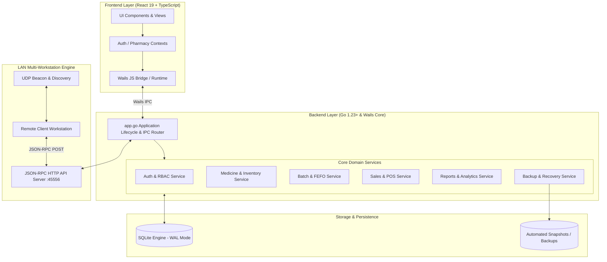

# Langratia Pharmacy POS

<div align="center">


### Professional Enterprise Pharmacy Management & Point of Sale System

[](https://go.dev/)
[](https://react.dev/)
[](https://www.typescriptlang.org/)
[](https://wails.io/)
[](https://www.sqlite.org/)
[](#installation--deployment)
[](LICENSE)

*A modern, offline-first, local-network capable desktop ERP designed specifically for modern pharmacies, drugstores, and healthcare dispensaries.*

[Features](#-key-features) • [Architecture](#-system-architecture) • [Getting Started](#-quick-start--development) • [LAN Multi-Station](#-multi-workstation-lan-mode) • [Documentation](#-documentation) • [Contributing](#-contributing)

</div>

---

## 📖 Overview

**Langratia Pharmacy POS** is a high-performance desktop application engineered with **Go (Wails v2)** on the backend and **React 19 + TypeScript + Tailwind CSS** on the frontend. It brings native performance, minimal memory usage, zero-latency local database transactions, and seamless local-area network (LAN) synchronization without requiring any cloud subscription or external server hosting.

Whether deployed as a single standalone computer in a community drugstore or as a distributed multi-terminal cluster (Host Server + Client POS Workstations) in a busy multi-counter pharmacy, Langratia provides an intuitive, robust, and audited workflow for dispensing medications, tracking inventory, and managing financials.

---

## ✨ Key Features

### 🛒 Point of Sale & Checkout
- **Instant Barcode & Name Search**: High-speed, keyboard-driven product lookup with instant fuzzy matching.
- **Dynamic Multi-Unit Pricing**: Sell items by unit (e.g., *Tablet, Strip, Box, Bottle, Blister*) with automated unit price conversions.
- **First-Expired-First-Out (FEFO) Lot Deduction**: Automatically draws stock from earliest-expiring batches upon checkout.
- **Split Payments & Discounts**: Support for Cash, Card, Mobile Money, with fixed or percentage discount constraints.
- **Clean Thermal Receipt Generation**: Ready-to-print formatted receipt slips with invoice IDs, cashier details, and tax breakdowns.

### 📦 Inventory & Batch Management
- **Lot / Batch Expiry Tracking**: Color-coded expiration alerts (Expired, Critical < 30 days, Warning < 90 days, Good).
- **Bulk CSV / Excel Ingestion**: Fast batch import of pharmaceutical catalogs and supplier inventories.
- **Stock Movements & Adjustments**: Full audit trails for damages, expired discards, vendor returns, and physical audits.
- **Low Stock Thresholds & Reorder Reminders**: Automatic notifications when inventory levels breach minimum quantities.

### 🌐 Multi-Workstation LAN Architecture
- **Host & Client Modes**: One PC operates as the primary Host (hosting the SQLite database and JSON-RPC API), while cashier terminals connect seamlessly over LAN.
- **Zero-Configuration UDP Discovery**: Workstations auto-discover the active Host on the local network.
- **Reflection-Based RPC Engine**: Native Go services dynamically respond to remote workstation calls transparently.

### 📋 Prescriptions & Patient Dispensing
- **Prescription Workflow**: Record prescribing physicians, patient demographics, and dosage instructions.
- **Partial & Full Dispensing**: Track multi-stage prescription refills and remaining quantity allowances.

### 📊 Analytics & Financial Reporting
- **Real-Time Financial Dashboard**: Visual metrics for daily revenue, gross margins, transaction counts, and inventory valuation.
- **Shift & Till Reconciliation**: Cashier shift opening, expected cash vs. physical count, closing reconciliation, and discrepancy tracking.
- **Detailed Exportable Reports**: Filter sales, purchases, profit margins, and inventory valuations across custom date ranges.

### 🔒 Enterprise Security & Auditability
- **Role-Based Access Control (RBAC)**: Fine-grained permissions for *Admin*, *Manager*, and *Cashier* roles.
- **Tamper-Evident Audit Logging**: System records every security event, price change, voided sale, and user login.
- **Automated Scheduled Backups**: SQLite database snapshots with Write-Ahead Logging (WAL) for 100% crash resilience.
- **Hardware-Bound Activation**: Cryptographic offline hardware activation support for controlled deployments.

---

## 🏗️ System Architecture



---

## 📁 Repository Structure

```
langratia-pharmacy/
├── .github/                     # GitHub Actions CI/CD workflows & issue templates
│   ├── workflows/
│   │   ├── ci.yml               # Multi-platform build & test pipeline
│   │   └── build-release.yml    # Windows NSIS installer & portable release pipeline
│   ├── ISSUE_TEMPLATE/          # Bug report & feature request templates
│   ├── PULL_REQUEST_TEMPLATE.md # Standard PR submission template
│   └── dependabot.yml           # Automated dependency update configuration
├── backend/                     # Go Backend Core
│   ├── api/                     # JSON-RPC server and client proxy
│   ├── db/                      # SQLite connection, migrations schema & seeder
│   ├── logger/                  # File & console logging utilities
│   ├── models/                  # Domain entity structs and types
│   ├── network/                 # UDP broadcast auto-discovery
│   └── services/                # Business logic services (Auth, Sales, Meds, Batches, Reports)
├── cmd/                         # Command-line developer utilities
│   └── keygen/                  # Hardware key generator tool
├── docs/                        # In-depth architectural and developer documentation
│   └── codebase-analysis/       # 20 detailed architectural reference guides
├── frontend/                    # Modern React 19 Frontend
│   ├── src/
│   │   ├── assets/              # Icons, logos, and medical form graphics
│   │   ├── components/          # Reusable UI widgets, layout, and DataGrid
│   │   ├── context/             # React Context providers (Auth, Permissions, Pharmacy)
│   │   ├── features/            # Feature modules (POS, Inventory, Reports, Settings, etc.)
│   │   └── utils/               # Formatting, currency, and calculation helpers
│   ├── package.json             # NPM dependencies & build scripts
│   ├── tsconfig.json            # TypeScript configuration
│   └── vite.config.ts           # Vite bundler configuration
├── build/                       # Build configuration, app icons & NSIS installer scripts
├── app.go                       # Wails IPC binding & application orchestration
├── main.go                      # Application entry point & webview configuration
├── wails.json                   # Wails project definition & installer metadata
├── go.mod                       # Go module dependencies
└── README.md                    # Project README
```

---

## 🚀 Quick Start & Development

### Prerequisites
Make sure the following tools are installed on your workstation:
1. **[Go 1.23+](https://go.dev/dl/)**
2. **[Node.js 20+ & npm](https://nodejs.org/)**
3. **[Wails v2 CLI](https://wails.io/docs/gettingstarted/installation)**:
   ```bash
   go install github.com/wailsapp/wails/v2/cmd/wails@latest
   ```
4. **C Compiler & Platform Tools**:
   - **Windows**: [NSIS](https://nsis.sourceforge.io/) (for building Windows Setup `.exe`)
   - **Linux**: `libgtk-3-dev`, `libwebkit2gtk-4.0-dev` (or `4.1-dev`)
   - **macOS**: Xcode Command Line Tools

### 1. Clone the Repository
```bash
git clone https://github.com/allaninfo-comp/langratia-pharmacy.git
cd langratia-pharmacy
```

### 2. Install Frontend Dependencies
```bash
cd frontend
npm install
cd ..
```

### 3. Run in Live Development Mode
Run the live-reloading development environment with hot frontend and backend reloading:
```bash
wails dev
```

### 4. Run Tests
Run the Go test suite:
```bash
go test -v -short ./...
```
Run the frontend unit tests:
```bash
cd frontend
npm test
```

---

## 📦 Building for Production

### Windows (.exe Installer & Portable)
To build a production-ready standalone executable and NSIS setup wizard:
```bash
wails build -nsis -clean -upx
```
The output binaries will be generated in `build/bin/`:
- `PharmacyPOS-Setup-Windows.exe` (Installer with Desktop & Start Menu shortcuts)
- `LangratiaPharmacyPOS.exe` (Portable zero-install executable)

For full installation and deployment options, see [README_INSTALLATION.md](README_INSTALLATION.md).

---

## 🌐 Multi-Workstation LAN Mode

Langratia Pharmacy POS can operate in two networking modes:

```
                  ┌─────────────────────────────────────┐
                  │          HOST WORKSTATION           │
                  │  (SQLite DB + JSON-RPC Server:45556)│
                  └──────────────────┬──────────────────┘
                                     │ Local Area Network (LAN)
           ┌─────────────────────────┴─────────────────────────┐
           ▼                                                   ▼
┌──────────────────────┐                           ┌──────────────────────┐
│ CLIENT CASHIER POS 1 │                           │ CLIENT CASHIER POS 2 │
│ (Remote JSON-RPC)    │                           │ (Remote JSON-RPC)    │
└──────────────────────┘                           └──────────────────────┘
```

1. **Host Workstation**:
   - Go to **Settings** $\rightarrow$ **Network Settings**.
   - Enable **Host Server Mode**.
   - The Host will bind to port `45556` and broadcast UDP presence on the LAN.
2. **Client Workstation**:
   - Open Langratia POS on cashier computers.
   - Go to **Settings** $\rightarrow$ **Network Settings**.
   - Click **Auto-Discover Host** or enter the Host IP address manually.
   - All transactions, sales, and inventory queries will route instantly to the Host database.

---

## 📚 Documentation

Comprehensive architectural and engineering documentation is available in the [`docs/`](docs/) directory:

- [Project Architecture Summary](docs/codebase-analysis/PROJECT_ARCHITECTURE_SUMMARY.md)
- [Architecture Overview](docs/codebase-analysis/01_architecture_overview.md)
- [Folder Structure](docs/codebase-analysis/02_folder_structure.md)
- [Frontend Architecture](docs/codebase-analysis/05_frontend_architecture.md)
- [Backend Architecture](docs/codebase-analysis/06_backend_architecture.md)
- [Service Layer Design](docs/codebase-analysis/07_service_layer.md)
- [Database Schema & Migrations](docs/codebase-analysis/08_database_schema.md)
- [Network & JSON-RPC Architecture](docs/codebase-analysis/10_network_rpc_architecture.md)
- [Security Analysis](docs/codebase-analysis/11_security_analysis.md)
- [Deployment & Packaging](docs/codebase-analysis/18_deployment_packaging.md)

---

## 🤝 Contributing

Contributions are welcome! Please read [CONTRIBUTING.md](CONTRIBUTING.md) and [CODE_OF_CONDUCT.md](CODE_OF_CONDUCT.md) before submitting pull requests.

1. Fork the Project
2. Create your Feature Branch (`git checkout -b feature/AmazingFeature`)
3. Commit your Changes (`git commit -m 'feat: add some amazing feature'`)
4. Push to the Branch (`git push origin feature/AmazingFeature`)
5. Open a Pull Request

---

## 🔒 Security

For security vulnerabilities, please refer to [SECURITY.md](SECURITY.md).

---

## 📄 License

Distributed under the **MIT License**. See [`LICENSE`](LICENSE) for details.

---

<div align="center">
  <sub>Built with ❤️ by <strong>Langratia Systems</strong> and the open source community.</sub>
</div>
